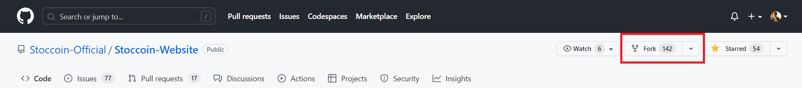

# Contribution Guidelines

1. Fork the repository, click on create fork.

    

2. To clone the repository to your local machine, follow these steps:

- Click on the "Code" button and copy the HTTPS Link.

    

- Open the terminal or command prompt on your computer.

- Navigate to the directory where you want to clone the repository.

    ```
    git clone https://github.com/<your_github_username>/Stoccoin-Website.git
    ```

- This will download the repository to your local machine

3. Create a new branch with a descriptive name for your feature/bug fix.

    ```
    git checkout -b feature/new-feature
    ```

4. Make changes and commits to your branch.

    ```
    git add .
    ```
    ```
    git commit -m "feat: Add new feature"
    ```

5. Push your branch to your forked repository.

    ```
    git push origin feature/new-feature
    ```

6. Submit a pull request to the original repository's master branch.

7. Wait for the maintainers to review your pull request and provide feedback.

8. Make any requested changes and push them to your forked repository.

9. Once your pull request is approved, it will be merged into the master branch.

That being said, it's important to write clear and descriptive commit messages to help other contributors understand the changes you've made to the code. Here are some common commit message types and their meanings:

- **feat:** A new feature has been added.

- **fix:** A bug has been fixed.

- **docs:** Changes have been made to documentation.

- **style:** Changes have been made to the code's style or formatting.

- **refactor:** The code has been refactored without changing its functionality.

- **test:** Changes have been made to unit tests or test cases.

- **chore:** Changes have been made to the build process or other non-code related tasks.

For example, a commit message for adding a new feature to a project could be:

`feat: Add user authentication system`

And a commit message for fixing a bug could be:

`fix: Fix bug in search function`

Using clear and descriptive commit messages like these can help others understand your changes and make it easier to maintain the codebase.

<br>

# Thanks For Contributing 🏆
